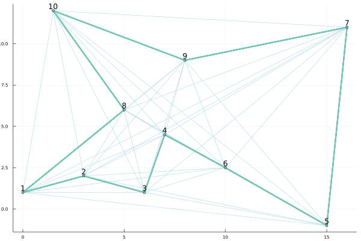

# Ants Systems


Section:

Artur Oleksiński

Wojciech Bieniek
## 1. Introduction

**The Ant systems** - the family of biological-inspired agent-based algorithms created for solving complex optimization problems with nature-inspired decision making.

The agents(ants) always seek the most optimal way of solving the problem with a chance of choosing other paths as the experiment. With this approach, we are obtaining the globally optimal solution for the given problem. As the ant algorithms are randomly initialized and operate on the probabilistic approach there is no guarantee that the solution obtained is indeed the most optimal for the given problem. 

Path preferential regulation is done by weighing them accordingly to the usage.
By increasing the pheromone level every time an ant crosses the path, the path becomes more attractive for the next ant that will have to choose a path at this point.

At this point, there are two main approaches to the procedure of depositing the pheromones on the path. The first being **the ant colony** approach when every ant deposits the pheromones when finishing the tour. The second is **the ant system** approach when the deposition procedure starts after all of the ants from the given iteration have completed the tour.

## 2. Example of the algorithm:

### Calculations and analysis

### The map example
```
1 p11 2 p21 3
O-----O-----O
 \   / \   /
   -     -
  p12   p22
```
Points are connected with paths. 
Paths p11 and p12 are connections between point nr 1 and point nr 2.
Paths p21 and p22 are connections between point nr 2 and point nr 3.

Point1:
- distance to 2 with path 11 is equal 1
- distance to 2 with path 12 is equal 2

Point2:
- distance to 3 with path 21 is equal 1
- distance to 3 with path 22 is equal 2

Every path has initial pheromone value $\tau_0$ = 1

$\eta_{i,j}$ = 1 / $d_{i,j}$

**Constatns**:

$\alpha$ = 1;
$\beta$  = 5;
$\rho$   = 0.5

**The $\eta$ values for given paths:**

$\eta_{1,1}$ = 1

$\eta_{1,2}$ = 1/2

$\eta_{2,1}$ = 1

$\eta_{2,2}$ = 1/2


**Calculating the values of $\Delta\tau_{i,j}$**

*$\Delta\tau_{i,j}$ is equal to the cumulative sum of inverse of the distance when ant k has crossed it.*

$\Delta\tau_{1,1}$ = 1

$\Delta\tau_{1,2}$ = 0.5

$\Delta\tau_{2,1}$ = 1

$\Delta\tau_{2,2}$ = 0.5

**Calculating the values of $\tau_{i,j}$ for the first iteration**

$\tau_{i,j}(n+1) = (1-\rho)*\tau_{i,j}(n) + \Delta\tau_{i,j}$

$\tau_{1,1}(1) = (1-\rho)*\tau_{1,1}(0) + \Delta\tau_{1,1} = (1 - 0.5) * 1 + 1 = 1.5 $

$\tau_{1,2}(1) = 0.5 * 1 + 0 = 0.5 $

$\tau_{2,1}(1) = 0.5 * 1 + 1 = 1.5 $

$\tau_{2,2}(1) = 0.5 $

**Calculating probabilities**

$p_{i,j}(n) = {\tau_{i,j}(n)^\alpha * \eta_{i,j} \over \Sigma { } \tau_{i,j}(n)^\alpha * \eta_{i,j}} $

$p_{1,1}(1) = {\tau_{1,1}(1)^\alpha * \eta_{1,1} \over \Sigma { } \tau_{1,1}(1)^\alpha * \eta_{1,1}} = {1.5 \over 1.5 + 0.25} = 0.857 $

$p_{1,2}(1) = 1 - p_{1,1}(1)$

$p_{2,1}(1) = p_{1,1}(1) $

$p_{2,2}(1) = p_{1,2}(1) $

$p_{1,1}(2) = {1.75 \over 1.75 + 0.125} = 0.923$

$p_{1,2}(2) = 0.077 $

$p_{1,1}(3) = {1.875 \over 1.875 + 0.0625} = 0.968$

$p_{1,2}(3) = 0.032 $

$p_{1,1}(4) = {1.9375 \over 1.9375 + 0.03125} = 0.984$

$p_{1,2}(4) = 0.016 $

**Filling the ___decision table___**

*Assuming that ant always chooses path with highest probability*


| Iteraction | Path11| Path12| Path21| Path22|
| ---------- | ----- | ----- | ----- | ----- |
|      1     | 0.857 | 0.143 | 0.857 | 0.143 |
|      2     | 0.923 | 0.077 | 0.923 | 0.077 |
|      3     | 0.968 | 0.032 | 0.968 | 0.032 |
|      4     | 0.984 | 0.016 | 0.984 | 0.016 |

## 3. Implementation

The main function.
The exemplary implementation of the ant system approach.
Initialization of graph, running the ant system implementation, and visualization of the results.

```julia
function main()
	graph = generate_map(x, y)
	used_paths = ant_system(graph, 1, 200)
	visualize_graph(graph, used_paths)
end
```

Starting with the initialization of the graph which contains ten points and connections from every point to every point.

```julia
function generate_map(x_coordinates, y_coordinates)
	"""
	Generator of graphs based on given points coordinates
	"""
	points = Vector{Point}()
	paths = Vector{UndirectedPath}()
	len_x = length(x_coordinates)
	
	if len_x == length(y_coordinates)
		for i in 1:len_x
			append!(points, [Point(i, 0, [
                x_coordinates[i], 
                y_coordinates[i]
            ])])
		end

		path_id = 1
		for i in 1:len_x
			for j in 1:len_x
				if points[i] != points[j]
					create = true
					for path in paths
						if  (path.connection.first == points[i].id || 
							path.connection.second == points[i].id) &&
							(path.connection.first == points[j].id || 
							path.connection.second == points[j].id)
							
							create = false
							break
						end
					end
					if create == true
						path = UndirectedPath(
                            path_id, 
                            Pair(points[i].id, points[j].id),
                             sqrt(
                                abs(x_coordinates[i]-x_coordinates[j])^2 + 
                                abs(y_coordinates[i]-y_coordinates[j])^2
                                ),
                            0.0001 
                            )
						append!(paths, [path])
						path_id +=1
					end
				end
			end
		end
		for point in points
			for path in paths
				if  path.connection.first == point.id  ||
                    path.connection.second == point.id
					append!(point.connections, [path])
				end
			end
		end

	end
	for i in points
		println(i)
	end
	for i in paths
		println(i)
	end
	return Graph(points, paths)
end

```

After creating the graph program proceeds with the implemented system.
Depending on the goal, two functions are implementing the algorithm.

The first: **The shortest path**.
This was described earlier in the calculations.

```julia

function shortest_path(
    graph::Graph, 
    starting_point_id::Int, 
    finish_point_id::Int, 
    type::String="default"
    )

	# Initialization
	starting_point = point_at(graph, starting_point_id)
	finish_point = point_at(graph, finish_point_id)

	number_of_points = length(graph.points)
	ants = init_ants(starting_point, number_of_points)
	decision_table = init_decision_table(graph)
	
	for ant in ants
		if finish_point != starting_point
			while ant.current_point.id != finish_point_id
				# Check if point has a crossroad
				paths = ant.current_point.connections
				println(paths)
				if length(paths) > 1
					decision = roll_next_path(decision_table, paths, ant)
					ant_move_to(graph, decision, ant)
				end
				decision_table = update_decision_table(
                    graph, 
                    decision_table, 
                    ant
                )
			end
		else
			println("Sales Ant is starts at destination, distance 0.\nIf you want ant to travel through all points then use ant_system()")
		end
	end
	best_ant(ants)
end
```

The second: **The traveling sales-ant**

```julia

function ant_system(graph::Graph, start_destination_id::Int, max_iter::Int=200)
	# Initialization
	number_of_points = length(graph.points)
	println(number_of_points)
	decision_table = init_decision_table(graph)
	ants = Vector{Ant}()
	for i in 1:max_iter
		
		ants = init_ants(graph, number_of_points)
		for ant in ants
			while length(ant.visited_points) < number_of_points
				paths = ant_available_paths(ant)
				decision = roll_next_path(decision_table, paths, ant)
				if ant_move_to(graph, decision, ant) == -1
					println("errrrr")
				end
			end

			decision = find_path(ant.current_point, ant.starting_point)
			ant_move_to(graph, decision, ant)
		end
		decision_table = update_decision_table(graph, decision_table, ants)
		z = [sum([y.weight for y in x.used_paths ]) for x in ants]
		println(minimum(z))
	end

	[println(decision_table[x],"\t", x) for x in keys(decision_table)]

	return best_ant(ants)
end

```

As these two implementations vary only in the details and not in the main solutions this paper will describe the traveling sales-ant problem which implements the ant system.

### Starting from the initialization phase of the program:

```julia
number_of_points = length(graph.points)
println(number_of_points)
decision_table = init_decision_table(graph)
ants = Vector{Ant}()
```
Initialization of decision table provides 2d dictionary with the id of points and id of the path as keys with starting decision value equal to $0.1$. 

```julia
function init_decision_table(graph::Graph)
	decision_table = Dict()
	for point in graph.points
		# find_all_connections(graph, point)
		decision_table[point.id] = Dict()

		for path in point.connections
			decision_table[point.id][path.id] = 0.1
		end
	end
	return decision_table
end
```

### The loop

Interating over the range 1 to max_iter( by default equal to 200 ).

```julia
for i in 1:max_iter
    ants = init_ants(graph, number_of_points)
    for ant in ants
        while length(ant.visited_points) < number_of_points
            paths = ant_available_paths(ant)
            decision = roll_next_path(decision_table, paths, ant)
            if ant_move_to(graph, decision, ant) == -1
                println("errrrr")
            end
        end
        decision = find_path(ant.current_point, ant.starting_point)
        ant_move_to(graph, decision, ant)
    end
    decision_table = update_decision_table(graph, decision_table, ants)
end
```

Initialization of a new group of ants for every iteration.
The number of ants in the group is equal to the number of points(cities) on the graph.
Every ant starts in a random city with this city set in the current_point, visited_cities, and the starting_point. Also, an ant is initialized with zero tour length(did not travel anywhere yet) and an empty used_paths vector.

```julia
function init_ants(graph::Graph, number_of_ants::Int)
	"""
	Ant vector initialization with starting point of every ant choosen as random
	"""
	ants = []
	for i in 1:number_of_ants
		starting_point = graph.points[rand(1:number_of_ants)]
		append!(ants, [Ant(
            starting_point, 
            [starting_point], 
            [], 
            0, 
            starting_point
        )])
	end
	return ants
end
```

For every ant, we check the progress of travel. Then we check the possible paths which will not lead to already visited cities and make the decision using the roulette wheel. Higher the pheromone level of the path, the higher chance that the ant will choose to walk it.

After a whole turn( while the loop closes ) we check the path which leads from the current point of the ant to the starting point( which is our final destination) and forces the ant to cross it.

When all of the ants will finish the tours we update the decision table accordingly to the decisions taken by the ants. Deposition of the pheromones and evaporation takes place before the update.

```julia
ants = init_ants(graph, number_of_points)
for ant in ants
    while length(ant.visited_points) < number_of_points
        paths = ant_available_paths(ant)
        decision = roll_next_path(decision_table, paths, ant)
        if ant_move_to(graph, decision, ant) == -1
            println("errrrr")
        end
    end

    decision = find_path(ant.current_point, ant.starting_point)
    ant_move_to(graph, decision, ant)
end
decision_table = update_decision_table(graph, decision_table, ants)
z = [sum([y.weight for y in x.used_paths ]) for x in ants]
println(minimum(z))
```

## The Ant

The ant holds the memory of visited cities, used paths, and starting point which was chosen randomly. Moreover, Ant knows what city is it in and how far has it traveled.

```julia
mutable struct Ant
	current_point::Point
	visited_points::Vector{Point}
	used_paths::Vector{UndirectedPath}
	tour_length::Float64
    starting_point::Point
end
```

## Restricting ant from traveling to already visited cities

The ants need to be guided to not walk in the circles and start to bring the improvements of the results. For this, ant checks if the city at the other end of the path is the city was already. 

```julia
function ant_available_paths(ant::Ant)
	available_paths = Vector{UndirectedPath}()

	for path in ant.current_point.connections
		if path.connection.first == ant.current_point.id
			if path.connection.second in [point.id for point in ant.visited_points]
			else
				append!(available_paths, [path])
			end
		elseif path.connection.second == ant.current_point.id
			if path.connection.first in [point.id for point in ant.visited_points]
			else
				append!(available_paths, [path])
			end
		end
	end

    return available_paths
end
```

After choosing the path with which ant will travel it need to move in this direction. The ant can not move to the city in which it is right now.

```julia
function ant_move_to(graph::Graph, path::UndirectedPath, ant::Ant)
	"""
	Transports the ant to the next point with choosen path and updates ant memory.
	path - UndirectedPath - Choosen path
	point - Point - Next point
	ant - Ant - Ant that made the decision 
	"""
	if ant.current_point == point_at(graph, path.connection.first)
		append!(ant.used_paths, [path])
		ant.current_point = point_at(graph, path.connection.second)
		append!(ant.visited_points, [point_at(graph, path.connection.second)])
		path.number_of_ants_crossed += 1
	elseif ant.current_point == point_at(graph, path.connection.second)
		append!(ant.used_paths, [path])
		ant.current_point = point_at(graph, path.connection.first)
		append!(ant.visited_points, [point_at(graph, path.connection.first)])
		path.number_of_ants_crossed += 1
	end

end
```


## Decision making

Every ant makes the decision based on the roulette wheel algorithm with values of the decision table.

```julia
function roll_next_path(decision_table::Dict{Any, Any}, available_paths::Vector{UndirectedPath}, ant::Ant)
    top = 0
    order = zeros(length(available_paths))
    for (i, path) in enumerate(available_paths)
        if path.connection.first == ant.current_point.id 
            order[i] = decision_table[path.connection.first][path.id]
            top += order[i]
        else
            order[i] = decision_table[path.connection.first][path.id]
            top += order[i]
        end
    end

    roll = rand(Uniform(0, 1))*top
    for i in 1:length(order)
        if roll < order[i]
            return available_paths[i]
        else
            roll -= order[i]
        end
    end
end

```

## Updating The Decision Table

```julia
function update_decision_table(graph::Graph, decision_table, ant::Ant)
	"""
	Updates the decision table after changes.
	"""
	α = 1
	β = 5
	ρ = 0.5

	for path in ant.used_paths
		ant.tour_length += path.weight
	end
	
	for path in graph.paths
		path.Δτ += Δτ(ant, path)
	end

	# Add partial Δτ's and evaporate
	for path in graph.paths
		path.pheromones = (1-ρ) * path.pheromones + path.Δτ
	end

	for point in graph.points
		sum_decisions = 0
		for path in point.connections
			sum_decisions += path.pheromones^α * (1/path.weight)^β #η^β
		end
		for path in point.connections
			decision_table[point.id][path.id] = (path.pheromones*((1/path.weight)^β))/sum_decisions
		end
	end

	return decision_table
end
```


## The whole code

**ants.jl**

```julia
include("graph.jl")

using Random
using Distributions
using Plots


x = [0 3 6 7 15 10 16 5 8 1.5]
y = [1 2 1 4.5 -1 2.5 11 6 9 12]


mutable struct Ant
	current_point::Point
	visited_points::Vector{Point}
	used_paths::Vector{UndirectedPath}
	tour_length::Float64
    starting_point::Point
end

Ant( c, v, u, s) = Ant( c, v, u, 0, s)

function data_init()
	"""
	Initialization of graph for the traveling sales ant
	"""
	point1 = Point(1, 1)
	point2 = Point(2, 1)
	point3 = Point(3, 1)

	path1 = UndirectedPath(1,Pair(point1.id, point2.id), 2, 1.0)
	path2 = UndirectedPath(2,Pair(point1.id, point2.id), 1, 1.0)
	path3 = UndirectedPath(3,Pair(point2.id, point3.id), 2, 1.0)
	path4 = UndirectedPath(4,Pair(point2.id, point3.id), 1, 1.0)

	point1.connections = Vector{UndirectedPath}([path1, path2])
	point2.connections = Vector{UndirectedPath}([path3, path4])
	graph = Graph([], [])

	points = [point1, point2, point3]
	paths = [path1, path2, path3, path4] 

	graph.paths = paths
	graph.points = points

	return graph
end

function generate_map(x_coordinates, y_coordinates)
	"""
	Generator of graphs based on given points coordinates
	"""
	points = Vector{Point}()
	paths = Vector{UndirectedPath}()
	len_x = length(x_coordinates)
	
	if len_x == length(y_coordinates)
		for i in 1:len_x
			append!(points, [Point(i, 0, [x_coordinates[i], y_coordinates[i]])])
		end

		path_id = 1
		for i in 1:len_x
			for j in 1:len_x
				if points[i] != points[j]
					create = true
					for path in paths
						if  (path.connection.first == points[i].id || 
							path.connection.second == points[i].id) &&
							(path.connection.first == points[j].id || 
							path.connection.second == points[j].id)
							
							create = false
							break
						end
					end
					if create == true
						path = UndirectedPath(path_id, Pair(points[i].id, points[j].id), sqrt(abs(x_coordinates[i]-x_coordinates[j])^2 + abs(y_coordinates[i]-y_coordinates[j])^2), 0.0001 )
						append!(paths, [path])
						path_id +=1
					end
				end
			end
		end
		for point in points
			for path in paths
				if path.connection.first == point.id  || path.connection.second == point.id
					append!(point.connections, [path])
				end
			end
		end

	end
	for i in points
		println(i)
	end
	for i in paths
		println(i)
	end
	return Graph(points, paths)
end

function ant_available_paths(ant::Ant)
	available_paths = Vector{UndirectedPath}()

	for path in ant.current_point.connections
		if path.connection.first == ant.current_point.id
			if path.connection.second in [point.id for point in ant.visited_points]
			else
				append!(available_paths, [path])
			end
		elseif path.connection.second == ant.current_point.id
			if path.connection.first in [point.id for point in ant.visited_points]
			else
				append!(available_paths, [path])
			end
		end
	end

    return available_paths
end

function roll_next_path(decision_table::Dict{Any, Any}, available_paths::Vector{UndirectedPath}, ant::Ant)
    top = 0
    order = zeros(length(available_paths))
    for (i, path) in enumerate(available_paths)
        if path.connection.first == ant.current_point.id 
            order[i] = decision_table[path.connection.first][path.id]
            top += order[i]
        else
            order[i] = decision_table[path.connection.first][path.id]
            top += order[i]
        end
    end

    roll = rand(Uniform(0, 1))*top
    for i in 1:length(order)
        if roll < order[i]
            return available_paths[i]
        else
            roll -= order[i]
        end
    end
end

function init_ants(graph::Graph, number_of_ants::Int)
	"""
	Ant vector initialization with starting point of every ant choosen as random
	"""
	ants = []
	for i in 1:number_of_ants
		starting_point = graph.points[rand(1:number_of_ants)]
		append!(ants, [Ant(starting_point, [starting_point], [], 0, starting_point)])
	end
	return ants
end

function init_ants(starting_point::Point, number_of_ants::Int)
	# init ants when all are starting from the same place
	ants = []
	for i in 1:number_of_ants
		append!(ants, [Ant(starting_point, [starting_point], [], starting_point)])
	end
	return ants
end

function init_pheromones(graph::Graph, amount_of_pheromone::Float16)
	# initialization of pheromons disposition UNUSED
	for path in graph.paths
		path.pheromones = amount_of_pheromone
	end
end

function best_ant(ants::Vector{Any})
	# Searching for the best ant. Used in the end of the program
	
	best_ant_len = Inf
	best_ant_index = -1
	for (i, ant) in enumerate(ants)
		summed = 0
		for path in ant.used_paths
		   summed += path.weight 
		end

		if summed < best_ant_len
			best_ant_len = summed
			best_ant_index = i
		end
	end
	println("\nThe best ant: ", best_ant_len, "\t", ants[best_ant_index], "\nPath:\n")
	[println(x) for x in ants[best_ant_index].used_paths]
	[println(x.connection) for x in ants[best_ant_index].used_paths]
	return ants[best_ant_index].used_paths
end

function init_decision_table(graph::Graph)
	decision_table = Dict()
	for point in graph.points
		# find_all_connections(graph, point)
		decision_table[point.id] = Dict()

		for path in point.connections
			decision_table[point.id][path.id] = 0.1
		end
	end
	return decision_table
end

function leave_pheromones(ants::Vector{Any})
	# Here we need to calculate how much pheromone is being deposited on the full path of the ant
	# Shorter overall path means higher level of pheromones being spread. 
	for ant in ants
		sum_distance = 0.0
		for path in ant.used_paths
			sum_distance += path.weight
		end

		for path in ant.used_paths
			path.pheromones += path.weight/sum_distance
		end
	end
end

function leave_pheromones_colony(path::UndirectedPath)
	path.pheromones += 1
end

function Δτ(ant, path)
	"""
	Calculating the Δτ 
	"""
	if path in ant.used_paths
		return 1/ant.tour_length
	else
		return 0
	end
end

function update_decision_table_colony(graph::Graph, decision_table, ant::Ant)
	"""
	Updates the decision table after changes.
	"""
	α = 1
	β = 5
	ρ = 0.5

	for point in graph.points
		sum_decisions = 0
		
		for path in point.connections
			path.pheromones = ρ*path.pheromones + Δτ(ant, path)
			sum_decisions += (path.pheromones^α)*((1/path.weight)^β)
		end

		for (i, path) in enumerate(point.connections)
			# println("Pheromones:\t", path.pheromones)
			decision_table[point.id][i] = (path.pheromones*((1/path.weight)^β))/sum_decisions
			# if decision == path
			#	 println("\nAnt at\t", ant.current_point, "\nArrived using path:\t", decision, "\nWith decision value:\t", decision_table[point.id][i], "\n")
				
			# end
		end
		
	end
	return decision_table
end

function update_decision_table(graph::Graph, decision_table, ant::Ant)
	"""
	Updates the decision table after changes.
	"""
	α = 1
	β = 5
	ρ = 0.5

	for path in ant.used_paths
		ant.tour_length += path.weight
	end
	
	for path in graph.paths
		path.Δτ += Δτ(ant, path)
	end

	# Add partial Δτ's and evaporate
	for path in graph.paths
		path.pheromones = (1-ρ) * path.pheromones + path.Δτ
	end

	for point in graph.points
		sum_decisions = 0
		for path in point.connections
			sum_decisions += path.pheromones^α * (1/path.weight)^β #η^β
		end
		for path in point.connections
			decision_table[point.id][path.id] = (path.pheromones*((1/path.weight)^β))/sum_decisions
		end
	end

	return decision_table
end

function update_decision_table(graph::Graph, decision_table, ants::Vector{Any})
	"""
	Updates the decision table after changes.
	"""
	α = 1
	β = 5
	ρ = 0.5

	for ant in ants
		for path in ant.used_paths
			ant.tour_length += path.weight
		end
		
		for path in graph.paths
			path.Δτ += Δτ(ant, path)
		end
	end
	
	# Add partial Δτ's and evaporate
	for path in graph.paths
		path.pheromones = (1-ρ) * path.pheromones + path.Δτ
	end

	for point in graph.points
		sum_decisions = 0
		for path in point.connections
			sum_decisions += path.pheromones^α * (1/path.weight)^β #η^β
		end
		for path in point.connections
			decision_table[point.id][path.id] = (path.pheromones*((1/path.weight)^β))/sum_decisions
		end
	end

	return decision_table
end

function ant_move_to(graph::Graph, path::UndirectedPath, ant::Ant)
	"""
	Transports the ant to the next point with choosen path and updates ant memory.
	path - UndirectedPath - Choosen path
	point - Point - Next point
	ant - Ant - Ant that made the decision 
	"""
	if ant.current_point == point_at(graph, path.connection.first)
		append!(ant.used_paths, [path])
		ant.current_point = point_at(graph, path.connection.second)
		append!(ant.visited_points, [point_at(graph, path.connection.second)])
		path.number_of_ants_crossed += 1
	elseif ant.current_point == point_at(graph, path.connection.second)
		append!(ant.used_paths, [path])
		ant.current_point = point_at(graph, path.connection.first)
		append!(ant.visited_points, [point_at(graph, path.connection.first)])
		path.number_of_ants_crossed += 1
	end

end

function shortest_path(graph::Graph, starting_point_id::Int, finish_point_id::Int, type::String="default")
	# Initialization
	starting_point = point_at(graph, starting_point_id)
	finish_point = point_at(graph, finish_point_id)

	number_of_points = length(graph.points)
	ants = init_ants(starting_point, number_of_points)
	decision_table = init_decision_table(graph)
	
	for ant in ants
		if finish_point != starting_point
			while ant.current_point.id != finish_point_id
				# Check if point has a crossroad
				paths = ant.current_point.connections
				println(paths)
				if length(paths) > 1
					decision = roll_next_path(decision_table, paths, ant)
					ant_move_to(graph, decision, ant)
				end
				decision_table = update_decision_table(graph, decision_table, ant)
			end
		else
			println("Sales Ant is starts at destination, distance 0.\nIf you want ant to travel through all points then use ant_system()")
		end
	end
	best_ant(ants)
end

function ant_system(graph::Graph, start_destination_id::Int, max_iter::Int=200)
	# Initialization
	number_of_points = length(graph.points)
	println(number_of_points)
	decision_table = init_decision_table(graph)
	ants = Vector{Ant}()
	for i in 1:max_iter
		ants = init_ants(graph, number_of_points)
		for ant in ants
			while length(ant.visited_points) < number_of_points
				paths = ant_available_paths(ant)
				decision = roll_next_path(decision_table, paths, ant)
				if ant_move_to(graph, decision, ant) == -1
					println("errrrr")
				end
			end

			decision = find_path(ant.current_point, ant.starting_point)
			ant_move_to(graph, decision, ant)
		end
		decision_table = update_decision_table(graph, decision_table, ants)
		z = [sum([y.weight for y in x.used_paths ]) for x in ants]
		println(minimum(z))
	end

	[println(decision_table[x],"\t", x) for x in keys(decision_table)]

	return best_ant(ants)

end

function ant_colony_system(graph::Graph,max_iter::Int=200)
	number_of_points = length(graph.points)
	println(number_of_points)
	decision_table = init_decision_table(graph)
	ants = Vector{Ant}()
	for i in 1:max_iter
		ants = init_ants(graph, number_of_points)
		for ant in ants
			while length(ant.visited_points) < number_of_points
				paths = ant_available_paths(ant)
				decision = roll_next_path(decision_table, paths, ant)
				if ant_move_to(graph, decision, ant) == -1
					println("errrrr")
				end
			end
			decision = find_path(ant.current_point, ant.starting_point)
			ant_move_to(graph, decision, ant)
		end
		decision_table = update_decision_table(graph, decision_table, ants)
	end

	[println(decision_table[x],"\t", x) for x in keys(decision_table)]

	return best_ant(ants)
end

function visualize_graph(graph::Graph, used_paths)
	points_coords_x = [point.coordinates[1] for point in graph.points]
	points_coords_y = [point.coordinates[2] for point in graph.points]

	plot(legend=false, thickness_scaling = 0.6)

	for index in 2:length(graph.points)
		first_point = graph.points[index]
		for jndex in 1:index-1
			second_point = graph.points[jndex]
			x = [first_point.coordinates[1], second_point.coordinates[1]]
			y = [first_point.coordinates[2], second_point.coordinates[2]]
			path_weight = 1

			plot!(x, y, lw=path_weight*1, color="lightblue")
		end
		for path in used_paths
			plot!(
				[point_at(graph, path.connection.first).coordinates[1], point_at(graph, path.connection.second).coordinates[1]], 
				[point_at(graph, path.connection.first).coordinates[2], point_at(graph, path.connection.second).coordinates[2]], 
				lw=3,
				color="#73C6B6"
			)   
		end
	end
	scatter!(points_coords_x, points_coords_y, color="#73C6B6", series_annotations=text.(1:length(x), :bottom))
end

function main()
	# graph = data_init()
	graph = generate_map(x, y)
	# shortest_path(graph, 1, 3)
	used_paths = ant_system(graph, 1, 200)
	visualize_graph(graph, used_paths)

end

main()


```

**graph.jl**

```julia
mutable struct UndirectedPath
    id::Int
    weight::Real
    pheromones::Float64
    connection::Pair{Int,Int}
    number_of_ants_crossed::Int
    Δτ::Float64

    function UndirectedPath(id, connection, weight, pheromones)
        new(id, weight, pheromones, connection, 0, 0)
    end
end

mutable struct Point
    id::Int
    value::Float16
    coordinates::Vector{Real}
    connections::Vector{UndirectedPath}
end

Point(id, value) = Point(id, value, [], [])
Point(id, value, coordinates) = Point(id, value, coordinates, [])

mutable struct Graph
    points::Vector{Point}
    paths::Vector{UndirectedPath}
end

function find_path(a::Point, b::Point)
    for path in a.connections
        if  path.connection.first == b.id ||
            path.connection.second == b.id
            return path
        end
    end
    for path in b.connections
        if  path.connection.first == a.id ||
            path.connection.second == a.id
            return path
        end
    end
end

function describe(point::Point)
    # TODO
end

function describe(path::UndirectedPath)
    # TODO
end

function point_at(graph::Graph, point_id::Int)
    for point in graph.points
        if point.id == point_id
            return point
        end
    end
    println("No point witch such ID.")
    return NaN
end

function path_at(graph::Graph, path_id::Int)
    for path in graph.paths
        if path.id == path_id
            return path
        end
    end
    println("No path witch such ID.")
    return NaN
end

function find_all_connections(graph::Graph, point::Point)
    for path in graph.paths
        if path.connection.first == point.id || path.connection.second == point.id
            append!(point.connections, [path])
        end
    end
end

function find_all_paths_with_point(graph::Graph, point::Point)
    conns = [] 
    for path in graph.paths
        if path.connection.first == point.id || path.connection.second == point.id
            append!(conns, [path])
        end
    end
    return conns
end

function find_all_connections(paths::Vector{UndirectedPath}, point::Point)
    for path in paths
        if path.connection.first == point.id || path.connection.second == point.id
            append!(point.connections, [path])
        end
    end
end

function find_all_paths_with_point(paths::Vector{UndirectedPath}, point::Point)
    conns = [] 
    for path in paths
        if path.connection.first == point.id || path.connection.second == point.id
            append!(conns, [path])
        end
    end
    return conns
end

function point_id(graph::Graph, point_at::Point)
    for index in 1:length(graph.points)
        if graph.points[index] == point_at
            return graph.points[index].id
        end
    end
end

function test_graph(graph::Graph)
    println(graph.points)
    println(graph.paths)
end

function dijiksta(start_point_id::Int, end_point_id::Int, graph::Graph)
    """ Dijikstra algorith for shortest path in the graph.
    
        Parameters:
            start_point_id - "s"
            end_point_id   - "e"
            graph          - "g"
    """

    distances = init_distances(start_point_id::Int, graph::Graph)

    println(distances)

    println(point_at(graph, 2))
end

function init_distances(start_point_id::Int, graph::Graph)
    distances = Dict()
    
    for point in graph.points
        distances[point.id] = Inf
    end
    distances[start_point_id] = 0
    
    return distances
end

# Example of usage
#
# raw"""
# point1 ----- point2 ---- point3         
#     \       /      \      /
#      \     /        \    /
#       \ __/          \__/
#
# """
# point1 = Point(1, 1)
# point2 = Point(2, 1)
# point3 = Point(3, 1)

# path1 = UndirectedPath(1,Pair(point1.id, point2.id), 2, 1.0)
# path2 = UndirectedPath(2,Pair(point1.id, point2.id), 1, 1.0)
# path3 = UndirectedPath(3,Pair(point2.id, point3.id), 2, 1.0)
# path4 = UndirectedPath(4,Pair(point2.id, point3.id), 1, 1.0)

# point1.connections = Vector{UndirectedPath}([path1, path2])
# point2.connections = Vector{UndirectedPath}([path3, path4])
# graph = Graph([], [])

# points = [point1, point2, point3]
# paths = [path1, path2, path3, path4] 

# graph.paths = paths
# graph.points = points

# return graph
```